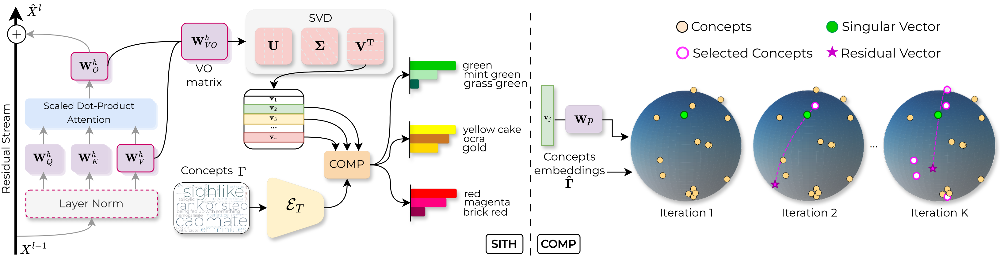

<div align="center">

# SITH: Semantic Inspection of Transformer Heads

**From Weights to Concepts: Data-Free Interpretability of CLIP via Singular Vector Decomposition**

<div align="center">

<a href="https://arxiv.org/abs/2603.24653"></a>

<a href="https://www.python.org"></a>
<a href="https://pytorch.org/get-started/locally/"></a>
<a href="LICENSE"></a>
</div>

[Francesco Gentile](https://github.com/frangente)<sup>1</sup>,
[Nicola Dall'Asen](https://fodark.xyz/)<sup>1,2</sup>,
[Francesco Tonini](https://tonini.dev/)<sup>1,3</sup>,
[Massimiliano Mancini](https://mancinimassimiliano.github.io/)<sup>1</sup>,
[Lorenzo Vaquero](https://scholar.google.es/citations?user=G0ZcGDYAAAAJ)<sup>3</sup>,
[Elisa Ricci](https://eliricci.eu/)<sup>1,3</sup>

<sup>1</sup>University of Trento &nbsp;
<sup>2</sup>University of Pisa &nbsp;
<sup>3</sup>Fondazione Bruno Kessler

</div>

<br>

<div align="center">
  
</div>

<br>

## Overview

SITH is a **data-free**, **training-free**, **weight-based** interpretability framework for CLIP's vision transformer. For each attention head, it decomposes the Value-Output (VO) weight matrix via **Singular Value Decomposition (SVD)**, revealing the head's dominant computational directions. Each singular vector is then interpreted using **COMP** (Coherent Orthogonal Matching Pursuit), a novel sparse decomposition algorithm that explains it as a non-negative combination of human-interpretable textual concepts, optimizing for both reconstruction fidelity and semantic coherence.

### Key Features

- **Data-free** — analysis is performed directly on model weights, with no dataset or activations needed.
- **Training-free** — no optimization or gradient computation required.
- **Fine-grained** — provides intra-head explanations at the individual singular vector level.
- **Actionable** — enables precise model edits (suppressing spurious correlations, removing unsafe concepts, improving classification) without retraining.

## Table of Contents

- [Installation](#installation)
- [Data](#data)
- [Scripts](#scripts)
- [Reproducing the Paper](#reproducing-the-paper)
- [Citation](#citation)
- [License](#license)

## Installation

SITH can be installed as a standalone library if you are interested in the core components (CLIP model utilities, sparse dictionary learning algorithms, etc.) without reproducing the paper's experiments:

```bash
uv pip install git+https://github.com/frangente/SITH.git
```

To reproduce the paper's experiments, clone the repository and install the dependencies:

```bash
git clone https://github.com/frangente/SITH.git
cd SITH
uv sync                       # core dependencies
uv sync --group scripts       # + dependencies for data preparation scripts
uv sync --group experiments   # + dependencies for experiments
```

## Data

All scripts and experiments expect intermediate data under `data/` in the repository root. Pre-computed resources for the experiments in the paper are available on [Google Drive](https://drive.google.com/drive/folders/1vL75AWVFsGPU-b1x6fenYdwjcAeL_OJx) and can be downloaded with:

```bash
uv run python scripts/download_model_data.py \
    --model-name ViT-L-14 \
    --pretrained laion2b_s32b_b82k
```

The expected layout is:

```
data/
├── dictionaries/                          # Textual concept pools
│   ├── conceptnet.txt
│   ├── wordnet.txt
│   └── ...
└── models/
    └── ViT-L-14/                          # Model architecture
        └── laion2b_s32b_b82k/             # Pretrained weights
            ├── image_mean.pt              # Mean image embedding (over CC12M)
            ├── dictionaries/              # Encoded dictionaries
            │   ├── conceptnet.pt
            │   └── ...
            └── decompositions/            # SITH decompositions
                ├── layer-20_right_foldln_conceptnet_comp-0.3_sparsity-5.pt
                ├── layer-20_left_nofoldln_conceptnet_omp_sparsity-10.pt
                └── ...
```

**Decomposition filenames** encode the key parameters for quick identification:

```
layer-{layer}_{left|right}_{foldln|nofoldln}_{dictionary}_{method}_sparsity-{K}.pt
```

Each `.pt` file contains a dict with `scores` and `indices` tensors, representing the sparse decomposition of the specified singular vectors for all heads in the given layer. Each tensor has shape `(num_heads * num_singular_vectors, K)`, where `K` is the sparsity level.

## Scripts

If you want to recompute the resources from scratch (e.g., for a different model or dictionary), the scripts under `scripts/` cover the full pipeline.

### 1. Download the Concept Dictionary

Download one of the available textual concept pools (e.g., [ConceptNet 5.5](https://conceptnet.io/)):

```bash
uv run python scripts/download_dictionary.py --dictionary conceptnet
```

Available dictionaries: `conceptnet`, `efros`, `laion`, `wordnet`.

### 2. Encode the Dictionary

Encode the textual dictionary into CLIP embeddings for a specific model:

```bash
uv run python scripts/encode_dictionary.py \
    --model-name ViT-L-14 \
    --pretrained laion2b_s32b_b82k \
    --dictionary conceptnet
```

### 3. Compute the Image Embedding Mean

Compute the mean image embedding over CC12M to mitigate the multimodality gap of CLIP:

```bash
uv run python scripts/compute_image_mean.py \
    --model-name ViT-L-14 \
    --pretrained laion2b_s32b_b82k
```

### 4. Decompose Attention Heads

Run SITH to decompose VO matrices into interpretable singular vectors:

```bash
uv run python scripts/decompose.py \
    --model-name ViT-L-14 \
    --pretrained laion2b_s32b_b82k \
    --layers 20 21 22 23 \
    --rank 64 \
    --method comp-0.3 \
    --sparsity 5 \
    --dictionary conceptnet \
    --sv-type right \
    --fold-ln
```

## Reproducing the Paper

The experiments from the paper are organized under `experiments/`, with one subdirectory per experiment. For additional details on how to run each experiment, please refer to the corresponding README in each directory.

| Section  | Experiment                           | Directory                                                    | Status |
| -------- | ------------------------------------ | ------------------------------------------------------------ | ------ |
| Sec. 4.1 | Interpretability-Fidelity Analysis   | [`experiments/fidelity/`](experiments/fidelity/)             | 🚫     |
| Sec. 4.2 | Grounding Singular Vectors to Images | [`experiments/grounding/`](experiments/grounding/)           | 🚫     |
| Sec. 5.1 | Suppressing Spurious Correlations    | [`experiments/spurious/`](experiments/spurious/)             | 🚫     |
| Sec. 5.2 | Removing NSFW Concepts               | [`experiments/nsfw/`](experiments/nsfw/)                     | 🚫     |
| Sec. 5.3 | Improving Classification Performance | [`experiments/classification/`](experiments/classification/) | 🚫     |
| Sec. 6   | Interpreting Model Adaptation        | [`experiments/finetune/`](experiments/finetune/)             | 🚫     |

## Citation

If you find this work useful, please cite our paper:

```bibtex
@inproceedings{gentile2026sith,
	title        = {From Weights to Concepts: Data-Free Interpretability of CLIP via Singular Vector Decomposition},
	author       = {Gentile, Francesco and Dall'Asen, Nicola and Tonini, Francesco and Mancini, Massimiliano and Vaquero, Lorenzo and Ricci, Elisa},
	year         = 2026,
	booktitle    = {Proceedings of the IEEE/CVF Conference on Computer Vision and Pattern Recognition (CVPR)}
}
```

## License

This project is licensed under the MIT License. See the [LICENSE](LICENSE) file for details.
